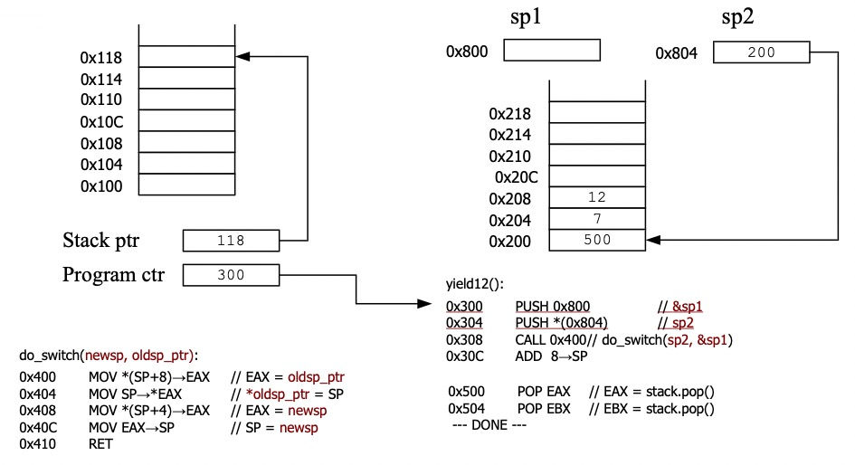

中文 所以ret 就是下面一个的ctr变成值放进stack？


是的，**RET** 指令的确是从栈中取出一个值，然后将该值作为程序计数器（PC）的新地址，继续执行该地址处的代码。具体来说，**RET** 是用来结束函数调用并返回到调用函数的地方。

它的执行过程是：

1. **从栈中弹出返回地址**：当执行 `CALL` 指令时，调用函数的下一条指令（也就是返回地址）会被压入栈中。这个返回地址通常是调用函数的下一条指令的地址，比如前面提到的 `0x30C`。
   
2. **恢复程序计数器（PC）**：`RET` 指令会从栈顶弹出这个返回地址，并将其赋值给程序计数器（PC）。PC 负责指示 CPU 下一步要执行的指令，所以通过 `RET`，程序跳转回调用函数时的位置，继续执行接下来的指令。

### 举个例子：

- 在 `0x308` 地址执行 `CALL 0x400` 后，**0x30C** 被压入栈中作为返回地址。
- 当 `do_switch` 函数执行完毕时，程序遇到 `RET` 指令。
- `RET` 指令会从栈中弹出先前压入的地址 **0x30C**，将它赋值给 PC。
- 这样，程序就会跳转到 **0x30C** 地址，继续执行从那里开始的指令。

因此，**RET** 实际上是取出栈中的返回地址，并将其用作程序的下一步执行位置。


在你的问题中，**0x804** 出现在 `PUSH *(0x804)` 这条指令中，具体来说是作为指针（地址）的一个值。我们可以从图和流程推断 **0x804** 是 `sp2` 的地址。

### 分析 **0x804** 的来源：

1. **sp1 和 sp2 是两个线程的栈指针**：从图中可以看到，`sp1` 的初始值为 **0x800**，而 `sp2` 的初始值为 **0x804**。这两个地址指向的是两个不同线程的栈位置，用于线程切换时保存和恢复各自的栈状态。

2. **保存栈指针的操作**：
   - 在 `yield12()` 函数中，有两条关键的指令：
     - `PUSH 0x800`：将 `sp1`（值为 **0x800**）压入栈中。
     - `PUSH *(0x804)`：这里的 `*(0x804)` 是取 **0x804** 这个地址处存储的值。换句话说，`0x804` 地址存储着线程 `sp2` 的栈指针（最初为 **0x200**）。

3. **线程切换时使用**：
   - `yield12()` 需要将两个线程的栈指针进行保存和切换。`0x804` 是用来保存 `sp2`（线程 2）的栈指针的地址。在线程切换时，`sp2` 的当前栈指针会被保存在 `0x804`，方便以后线程切回时从这个位置恢复。
   
4. **PUSH *(0x804)** 作用：
   - 这一条指令的意思是将 **0x804** 地址处存储的值（也就是 `sp2` 的当前栈指针）压入栈中，以便在执行 `do_switch` 时能够正确保存和恢复两个线程的栈状态。

### 总结：
- **0x804** 是 `sp2` 的地址，用于保存线程 2 的栈指针。
- `PUSH *(0x804)` 这一指令实际上是将存储在 **0x804** 地址处的 `sp2` 的栈指针值压入栈中。

所以，**0x804** 来自于图中的 `sp2`，它是用来保存和恢复线程 2 栈状态的地址。


如果你的问题是指“怎么做到线程切换（即栈指针的保存和恢复）？”我可以详细解释一下线程切换的过程，尤其是栈指针的保存和恢复是如何实现的。

### 线程切换的关键步骤：
线程切换的核心是保存当前线程的栈指针，并将栈切换到另一个线程的栈指针。具体步骤如下：

1. **保存当前线程的栈指针**：
   - 每个线程都有自己的栈，用来存放局部变量、返回地址等。线程切换时，首先需要保存当前线程的栈指针，以便以后可以恢复到这个线程。
   - 在图中的 `yield12()` 函数里，`PUSH 0x800` 和 `PUSH *(0x804)` 分别将两个线程的栈指针保存到栈上。这里 `0x800` 是 `sp1`（线程 1）的栈指针，而 `*(0x804)` 是 `sp2`（线程 2）的栈指针。

2. **调用 `do_switch` 函数进行切换**：
   - `CALL 0x400` 跳转到 `do_switch(sp2, &sp1)`，这里的 `do_switch` 函数负责实际的栈指针切换。
   - 在 `do_switch` 函数中，执行以下操作：
     - 将当前栈指针保存到 `sp2` 的内存地址中（即 `0x804`）。这意味着 `sp2` 会保存线程 2 切换前的栈指针。
     - 然后，加载 `sp1` 的值到栈指针（SP），也就是说切换到线程 1 的栈上继续执行。

3. **恢复另一个线程的栈指针**：
   - `MOV EAX -> SP` 将 `sp1` 的值（即 `0x800`）赋值给当前的栈指针 SP。这样，CPU 就切换到了线程 1 的栈上。
   - 随后，`RET` 指令从栈中弹出返回地址，并继续执行线程 1 的代码。
   - 当线程切换回来时，可以通过栈指针恢复原线程的执行状态。

### 线程切换的过程总结：
- 线程切换的本质是将当前线程的栈指针保存起来，并将 CPU 的栈指针设置为另一个线程的栈指针。
- 通过 `PUSH` 和 `MOV` 操作，栈指针（SP）会切换到不同的线程栈上。
- 线程切换后，程序会从另一个线程的栈恢复执行。

### 付出的代价（开销）：
线程切换需要保存和恢复线程的栈指针、寄存器等状态，因此线程切换会有一定的性能开销。尤其是在多线程环境中，频繁的线程切换会导致系统性能下降。操作系统或调度器通常会决定何时进行线程切换，以保证系统的效率。

如果你的问题指的是其他方面，比如某个具体细节，请进一步澄清，我可以为你详细解答。


好的！为了帮助你更加清晰地理解整个线程切换过程，我将所有步骤整合起来，并在每一步展示完整的栈变化和状态。每一步将包括栈的完整图示、寄存器状态和程序计数器（PC）的变化。

---

### **初始状态**：
- **SP** = 0x118
- **PC** = 0x300
- 栈初始状态（栈从高地址向低地址增长）：
```
  | 0x118 | 栈顶
  | 0x114 | 空
  | 0x110 | 空
  | 0x10C | 空
  | 0x108 | 空
  | 0x104 | 空
  | 0x100 | 空
```

---

### **1. 执行 `PUSH 0x800`** （指令地址 0x300）：
- **SP** 从 0x118 移动到 0x114，将值 **0x800** 压入栈中。
- **PC** = 0x304

栈状态：
```
  | 0x118 | 空
  | 0x114 | 0x800
  | 0x110 | 空
  | 0x10C | 空
  | 0x108 | 空
  | 0x104 | 空
  | 0x100 | 空
```

---

### **2. 执行 `PUSH *(0x804)`** （指令地址 0x304）：
- **SP** 从 0x114 移动到 0x110，取内存地址 **0x804** 的值 **0x200**，并将其压入栈中。
- **PC** = 0x308

栈状态：
```
  | 0x118 | 空
  | 0x114 | 0x800
  | 0x110 | 0x200
  | 0x10C | 空
  | 0x108 | 空
  | 0x104 | 空
  | 0x100 | 空
```

---

### **3. 执行 `CALL 0x400`** （指令地址 0x308）：
- **SP** 从 0x110 移动到 0x10C，将返回地址 **0x30C** 压入栈中。
- **PC** 跳转到 0x400，进入 `do_switch` 函数。

栈状态：
```
  | 0x118 | 空
  | 0x114 | 0x800
  | 0x110 | 0x200
  | 0x10C | 0x30C
  | 0x108 | 空
  | 0x104 | 空
  | 0x100 | 空
```

---

### **4. 执行 `MOV *(SP+8) -> EAX`** （指令地址 0x400）：
- 从 **SP+8** 处（即地址 **0x804**）取值 **0x804**，并将其赋值给 **EAX**。
- **PC** = 0x404

寄存器状态：
- **EAX** = 0x804
- **SP** = 0x10C，，对从这边指向，往上偏移两个

---

### **5. 执行 `MOV SP -> *EAX`** （指令地址 0x404）：
- 将当前栈指针 **SP = 0x10C** 写入 **EAX**（即 **0x804**）对应的内存地址，更新 `sp2` 的栈指针。
- **PC** = 0x408

栈状态：
```
  | 0x118 | 空
  | 0x114 | 0x800
  | 0x110 | 0x200
  | 0x10C | 0x30C
  | 0x108 | 空
  | 0x104 | 空
  | 0x100 | 空
```

内存状态：
- **0x804** = 0x10C

---

### **6. 执行 `MOV *(SP+4) -> EAX`** （指令地址 0x408）：
- 从 **SP+4** 处（即 **0x114** 地址）取值 **0x800**，并将其赋值给 **EAX**。
- **PC** = 0x40C

寄存器状态：
- **EAX** = 0x800
- **SP** = 0x10C

---

### **7. 执行 `MOV EAX -> SP`** （指令地址 0x40C）：
- 将栈指针 **SP** 更新为 **EAX** 的值，即 **0x800**，切换到 `sp1` 的栈。
- **PC** = 0x410

栈指针状态：
```
  | 0x800 | 栈顶
  | 0x804 | 空
  | 0x808 | 空
  | 0x80C | 空
  | 0x810 | 空
  | 0x814 | 空
  | 0x818 | 空
```

---

### **8. 执行 `RET`** （指令地址 0x410）：
- 从栈顶弹出返回地址 **0x30C**，并将其赋值给 **PC**。
- 栈指针 **SP** 上升到 **0x804**。

栈状态：
```
  | 0x804 | 栈顶
  | 0x808 | 空
  | 0x80C | 空
  | 0x810 | 空
  | 0x814 | 空
  | 0x818 | 空
```

寄存器状态：
- **PC** = 0x30C
- **SP** = 0x804

---

### **9. 执行 `ADD 8 -> SP`** （指令地址 0x30C）：
- **SP** 增加 8，栈指针从 **0x804** 增加到 **0x80C**。
- **PC** = 0x500

栈指针状态：
```
  | 0x80C | 栈顶
  | 0x810 | 空
  | 0x814 | 空
  | 0x818 | 空
```

---

### **10. 执行 `POP EAX`** （指令地址 0x500）：
- 从栈顶弹出值 **0x500** 并赋值给 **EAX**，栈指针 **SP** 上升到 **0x808**。
- **PC** = 0x504

栈状态：
```
  | 0x808 | 栈顶
  | 0x80C | 空
  | 0x810 | 空
  | 0x814 | 空
  | 0x818 | 空
```

寄存器状态：
- **EAX** = 500
- **SP** = 0x808

---

### **11. 执行 `POP EBX`** （指令地址 0x504）：
- 从栈顶弹出值 **0x7** 并赋值给 **EBX**，栈指针 **SP** 上升到 **0x80C**。
- **PC** = 0x508

栈状态：
```
  | 0x80C | 栈顶
  | 0x810 | 空
  | 0x814 | 空
  | 0x818 | 空
```

寄存器状态：
- **EBX** = 7
- **SP** = 0x80C

---

### **总结：**

通过这个整合，每一步的操作对栈指针、寄存器和程序计数器（PC）的变化进行了详细的说明，并展示了栈的完整状态。栈的变化清楚地展示了如何通过 `do_switch` 函数在两个线程之间切换，保存和恢复不同线程的栈指针，从而实现多线程的运行和管理。

希望这个完整的栈变化和图示能够帮助你更好地理解整个线程切换过程！如果有其他问题，请随时提问！


关于 **+8 变成 0x804** 的问题，这里实际上是指栈指针（**SP**）加上一个偏移量，然后在该位置取值的操作。具体来说，我们看下执行指令 **MOV *(SP+8) -> EAX** 时发生了什么。

### 背景解释：

当栈指针 **SP** 指向某个位置时，**SP+8** 是基于栈指针位置的偏移。也就是说，**SP** 是当前栈顶的位置，而 **SP+8** 是从栈顶往上（内存地址递增的方向）移动 8 个字节的位置。

### 指令分析：
在 **步骤4** 中，执行了指令：
```
MOV *(SP+8) -> EAX
```

这条指令的意思是：从栈指针 **SP** 加上 8 个字节的内存位置，读取该地址处的值，并将这个值存入寄存器 **EAX**。

#### 现在我们来分析为什么 **SP+8** 会等于 **0x804**：

1. **栈指针当前值**：此时 **SP** = **0x10C**，也就是说栈指针指向 **0x10C** 这个位置，当前栈中保存的是返回地址 **0x30C**。
   
2. **SP+8 的含义**：当 **SP = 0x10C** 时，`SP + 8` 就是 `0x10C + 8 = 0x114`，因此栈中的 **0x114** 位置就是 **SP+8** 所指的位置。

3. **从 0x114 处取值**：根据栈的状态，我们知道 **0x114** 这个位置保存的是 **0x804**。因此，执行 `MOV *(SP+8) -> EAX` 就是从 **0x114** 地址处获取值 **0x804**，并将这个值存入 **EAX**。

### 具体流程：

- **SP = 0x10C**，指向栈中存储返回地址的地方。
- **SP + 8 = 0x114**，这个位置在栈中保存了 **0x804**（即 `sp2` 的地址）。
- 执行指令 `MOV *(SP+8) -> EAX`，从 **0x114** 位置取出值 **0x804**，然后将这个值赋给寄存器 **EAX**。

### 为什么会是 **0x804**：
- **0x804** 是 `sp2` 的地址，在多线程切换中，用于保存线程2的栈指针。
- 在调用线程切换函数时，将 `sp2` 的地址 **0x804** 压入了栈，这就是为什么 **SP+8** 对应的值是 **0x804**。

### 总结：
- **SP+8** 表示的是当前栈指针位置 **SP** 往上偏移 8 个字节。
- 在 **SP = 0x10C** 时，**SP+8** 就是 **0x114** 处的值，而 **0x114** 位置上存储的值是 **0x804**，这是 `sp2` 的地址。
- 因此，执行 `MOV *(SP+8) -> EAX` 之后，**EAX** 的值变成 **0x804**。

希望这个解释能够清晰说明 **+8 变成 0x804** 的原因！如果你还有其他问题或需要进一步解释，随时告诉我。