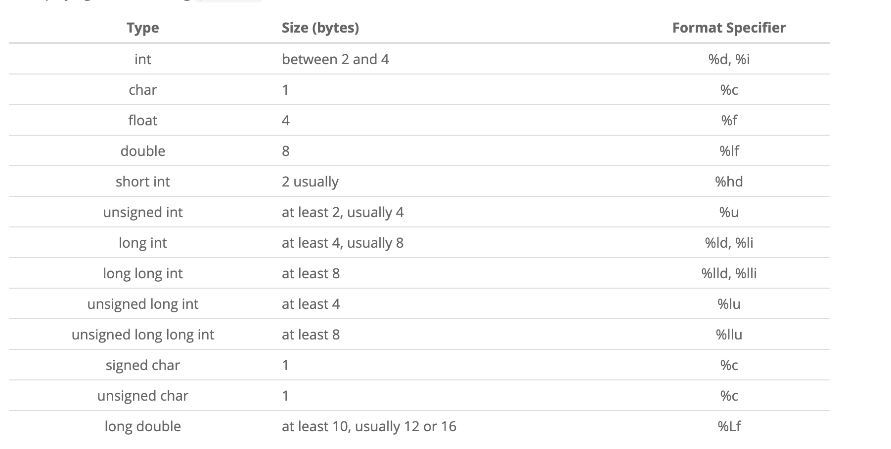
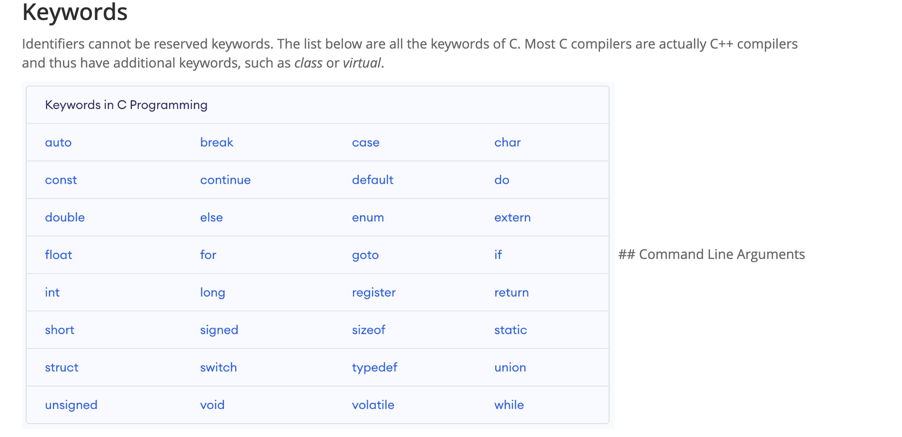

# Hello World C Program Example

Use an editor such as `vim` to type in the program below and save it under the name `hello.c`.

```c
#include <stdio.h>
// 包含标准输入输出库头文件 standard input output
// .h 代表的是 "header"，即头文件（header file）的缩写。

int main(int argc, char* argv[]) {
//  整数argument count 2. 字符串指针数组 argument vector，即参数向量。
// char* 表示一个指向字符（char）的指针。
// argv[]：存储这些命令行参数的字符串数组
// argv[0] 是程序的名称（例如 ./myprogram）。
// argv[1] 到 argv[argc-1] 是传递给程序的实际参数（例如 arg1、arg2、arg3）。
  printf("Hello World\n");
  return 0;
}
```
In Linux, compile the program from the shell using the command:
```py
gcc hello.c -o hello # -o hello是给名字
```
The option `-o hello` specifies the `name` of the executable program. If it is not specified, it will `default` to `a.out`.
这条命令会使用 gcc 编译器将 hello.c 编译成一个名为 hello 的可执行文件。生成的 hello 文件可以在命令行中通过 ./hello 来执行。
```c
./hello
```
解释：
`gcc`：GNU C 编译器，用于编译C程序。
`hello.c`：C程序的源文件。
`-o hello`：指定编译后的输出文件名为 hello。如果没有指定这个选项，默认的输出文件名会是 a.out。
`./hello`：运行当前目录中的 hello 可执行文件。由于当前目录 . 通常不在系统的执行路径中，必须使用 ./ 明确指定运行当前目录下的可执行文件。

The `./` is required because the current directory is generally not included in the system's searched path for programs in Linux.

Line 3: The definition of the main function where execution starts. The body of the function is between { and }.

If there is no return statement, `then the return is implicit` but the return value is not defined and should only be used for functions with a return type of void.

Note that every statement must be terminated by a semi-colon ;.Statements may span several lines.

Source files are text files with the .c extension.

## 系统调用理解
每个C程序都必须有一个调用main的函数。程序的执行从main中的第一条语句开始。main函数在程序运行的进程创建时由操作系统调用。由于程序通常从命令行(shell或终端)运行，它们可以将参数作为输入，这就是为什么main有两个参数的原因:命令行传递的参数数量和与参数对应的字符串数组。


## data types

C 给我们提供了下列定义整数的类型：
- char
- int
- short
- long

int 占据至少两个字节。short 占据至少两个字节。long 占据至少四个字节。

在 Arduino Uno 开发板上，int 占两个字节，范围从 -32,768 到 32,767。在 Arduino MKR 1010 上，int 占四个字节，范围从 -2,147,483,648 到 2,147,483,647。差异还真不小。
在所有的 Arduino 开发板上，short 都占两个字节，范围从 -32,768 到 32,767。long 占四个字节，范围从 -2,147,483,648 到 2,147,483,647。

## 无符号整数
对于以上所有的数据类型，我们都可以在其前面追加一个 unsigned。这样一来，值的范围就不再从负数开始，而是从 0 开始。这在很多情况下是很有用的。
- unsigned char 的范围从 0 开始，至少到 255
- unsigned int 的范围从 0 开始，至少到 65,535
- unsigned short 的范围从 0 开始，至少到 65,535
- unsigned long 的范围从 0 开始，至少到 4,294,967,295

## 溢出的问题
C语言不执行类型检查，因此程序员有责任确保为变量分配了足够的内存来保存分配给变量的值。例如，将32位(4字节)整数赋值给char类型的变量(8位或1字节字符)会导致溢出。赋值仍然完成，四个字节被复制到为一个字节保留的内存中，导致剩余的3个字节溢出到内存中的下三个字节，可能会覆盖其他变量。这是程序员头疼的一个常见问题。现代编译器会“检测”


鉴于所有这些限制，可能会出现一个问题：我们如何确保数字不超过限制？如果超过了限制会怎样？
如果你有一个值为 255 的 unsigned int，自增返回的值为 256，这在意料之中。如果你有一个值为 255 的 unsigned char，你得到的结果就是 0。它重置为了初始值。
如果你有一个值为 255 的 unsigned char，给它加上 10 会得到数字 9：
```c
#include<stdio.h>
int main(void){
    unsigned char j = 255;
    j = j + 10;
    printf("%u", j);  // 9
}
```

If you don't have a signed value, the behavior is undefined. 原文这里可能是 typo，从代码来看，这里描述的是有符号整数的溢出行为。如果你的值是有符号的，程序的行为则是未知的。程序基本上会给你一个很大的值，这个值可能变化，就像这样：

```c
#include <stdio.h>
int main(void){
    char j = 127;
    j = j + 10;
    printf("%u", j);  // 4294967177
}
```

换句话说，C 并不会在你超出类型的限制时保护你。对于这种情况，你需要自己当心。


## 浮点数
浮点类型可以表示的数值范围比整数大得多，还可以表示整数无法表示的分数。

使用浮点数时，我们将数表示成小数乘以 10 的幂。

你可能见过浮点数被写成

1.29e-3
-2.3e+5
和其它的一些看起来很奇怪的形式。

下面的几种类型：

- float
- double
- long double
是用来表示带有小数点的数字（浮点类型）的。这几种类型都可以表示正数和负数。

任何 C 的实现都必须满足的最小要求是 float 可以表示范围在 10^-37 到 10^+37 之间的数，这通常用 32 位比特实现。 double 可以表示一组更大范围的数，long double 可以保存的数还要更多。

与整数一样，浮点数的确切值取决于具体实现。

在现代的 Mac 上，float 用 32 位表示，精度为 24 个有效位，剩余 8 位被用来编码指数部分。

double 用 64 位表示，精度为 53 个有效位，剩余 11 为用于编码指数部分。

long double 类型用 80 位表示，精度为 64 位有效位，剩余 15 位被用来编码指数部分。

你如何能在自己的计算机上确定这些类型的大小呢？你可以写一个程序来干这事儿：
```c
#include <stdio.h>

int main(void) {
  printf("char size: %lu bytes\n", sizeof(char));
  printf("int size: %lu bytes\n", sizeof(int));
  printf("short size: %lu bytes\n", sizeof(short));
  printf("long size: %lu bytes\n", sizeof(long));
  printf("float size: %lu bytes\n", sizeof(float));
  printf("double size: %lu bytes\n", sizeof(double));
  printf("long double size: %lu bytes\n", sizeof(long double));
}
```
在我的系统上（一台现代 Mac），输出如下：
```
char size: 1 bytes
int size: 4 bytes
short size: 2 bytes
long size: 8 bytes
float size: 4 bytes
double size: 8 bytes
long double size: 16 bytes
```

常量
咱们现在来谈谈常量。

常量的声明与变量类似，不同之处在于常量声明的前面带有 const 关键字，并且你总是需要给常量指定一个值。

就像这样：
```c
const int age = 37;
```
这在 C 中是完全有效的，尽管通常情况下将常量声明为大写，就像这样：
```c
const int AGE = 37;
```
虽然这只是一个惯例，但是在你阅读或编写 C 程序时，他能给你提供巨大的帮助，因为它提高了可读性。大写的名字意味着常量，小写的名字意味着变量。

常量的命名规则与变量相同：可以包含任意大小写字母、数字和下划线，但是不能以数字开头。AGE 和 Age10 都是有效的变量名，而 1AGE 就不是了。

另一种定义常量的方式是使用这种语法：
```c
#define AGE 37
```
### Identifiers
An identifier is the name given to entities such as variables, functions, structures, etc. Identifiers must be unique within a program block (its scope). Identifier are used to refer to a memory object.
`
int amount;
double accountBalance;`




```c
#include <stdio.h>

int main(int argc, char* argv[])
{
  for (int i = 0; i < argc; ++i) {
    printf("%i | %s\n", i, argv[i]);//程序会按顺序输出 i 和 argv[i]
  }

  return 0;
}
```

```
0 | ./program
1 | arg1
2 | arg2
```
1.` %i`
含义：用于格式化并输出一个整数（int 类型）。
在这里的作用：输出当前的循环索引 i，即命令行参数的序号。
虽然 %i 和 %d 都可以用于表示整数，在 printf 中它们是等价的。
2. `|`
含义：这是一个竖线字符，没有特别的格式化作用，只是作为一个分隔符出现在输出中，起到视觉分隔的作用。
在这里的作用：用于分隔输出的序号和命令行参数。
3.` %s`
含义：用于格式化并输出一个字符串（char* 类型）。
在这里的作用：输出 argv[i]，即命令行中传递给程序的参数字符串。
4. `\n`
含义：这是一个换行符，表示输出结束后换行。
在这里的作用：每次输出参数信息后，换到下一行进行新的输出，保持输出格式的整齐
```c
#include <stdio.h>

int main() {
  printf("Goodbye, World!");
  return 0;
}
```
f we want to say that our code was run successfully, we will return the number 0. A number greater than 0 will mean that the program that we wrote failed.


## Variables and Types
### Data types
- Integers - whole numbers which can be either positive or negative. Defined using char, int, short, long or long long.
- Unsigned integers - whole numbers which can only be positive. Defined using unsigned char, unsigned int, unsigned short, unsigned long or unsigned long long.
- Floating point numbers - real numbers (numbers with fractions). Defined using float and double.
- Structures - will be explained later, in the Structures section.


**note** that c does not have a boolean type. usually, it is defined using the following notation:

```c
#define BOOL char
#define FALSE 0
#define TRUE 1
```

c uses arrays of characters to define strings, and will be explained in the strings section.

### defining variables
for numbers, we will usually use the type `int`. on most computers today, it is a 32-bit number, which means the number can range from -2,147,483,648 to 2,147,483,647.

to define the variables `foo` and `bar`, we need to use the following syntax:

```c
int foo;
int bar = 1;
```

the variable `foo` can be used, but since we did not initialize it, we don't know what's in it. the variable `bar` contains the number `1`.

now, we can do some math. assuming `a`, `b`, `c`, `d`, and `e` are variables, we can simply use plus, minus and multiplication operators in the following notation, and assign a new value to `a`:

```c
int a = 0, b = 1, c = 2, d = 3, e = 4;
a = b - c + d * e;
printf("%d", a); /* will print 1-2+3*4 = 11 */
```
 - 记得要用；来隔开


 arrays  
arrays are special variables which can hold more than one value under the same variable name, organised with an index. arrays are defined using a very straightforward syntax:

```c
/* defines an array of 10 integers */
int numbers[10];
```

accessing a number from the array is done using the same syntax. notice that arrays in c are zero-based, which means that if we defined an array of size 10, then the array cells 0 through 9 (inclusive) are defined. `numbers[10]` is not an actual value.

```c
int numbers[10];

/* populate the array */
numbers[0] = 10;
numbers[1] = 20;
numbers[2] = 30;
numbers[3] = 40;
numbers[4] = 50;
numbers[5] = 60;
numbers[6] = 70;

/* print the 7th number from the array, which has an index of 6 */
printf("the 7th number in the array is %d", numbers[6]);
```

arrays can only have one type of variable, because they are implemented as a sequence of values in the computer's memory. because of that, accessing a specific array cell is very efficient.

### exercise  
the code below does not compile, because the `grades` variable is missing.  
one of the grades is missing. can you define it so the grade average will be 85?

```c
#include <stdio.h>

int main() {
    int grades[5] = {90, 85, 80, 90, /* missing grade */};
    
    /* calculate the sum of the grades */
    int sum = 90 + 85 + 80 + 90;
    
    /* the total sum needed for an average of 85 (85 * 5) */
    int total_sum = 85 * 5;
    
    /* calculate the missing grade */
    int missing_grade = total_sum - sum;
    
    /* assign the missing grade to the array */
    grades[4] = missing_grade;
    
    /* print the grades */
    for (int i = 0; i < 5; i++) {
        printf("grade %d: %d\n", i + 1, grades[i]);
    }
    
    /* calculate the average */
    sum = 0;
    for (int i = 0; i < 5; i++) {
        sum += grades[i];
    }
    int average = sum / 5;
    
    printf("the average grade is %d\n", average);
    
    return 0;
}
```

in this solution, the missing grade is calculated based on the target average of 85, and then assigned to the array. the result will output the complete list of grades and confirm that their average is 85.


当然可以，这里是用中文解释的代码修正和注意事项：

```c
#include <stdio.h>

int main() {
    int grades[3]; // 之前有错，用于存储3个成绩的数组
    int average;

    grades[0] = 80;
    grades[1] = 85; // 之前有错，没有用分号
    grades[2] = 90;

    average = (grades[0] + grades[1] + grades[2]) / 3;
    printf("这三门课的平均分是: %d\n", average);

    return 0;
}
```

### 注意事项：
1. **数组初始化：** 你已经正确地定义了一个长度为3的数组 `grades` 来存储三个成绩。
2. **计算平均值：** 你正确地通过对三个成绩求和并除以3来计算平均值。
3. **注释说明：** 注释中建议你定义一个缺失的成绩来使平均值为85。因为你已经有80和90两个成绩，所以缺失的成绩应该是85，以便使平均值达到85。
4. **分号：** 确保每个语句以分号 (`;`) 结束，这在C语言中是必需的。
```markdown
## Multidimensional Arrays

In the previous tutorials on arrays, we covered arrays and how they work. The arrays we looked at were all one-dimensional, but C can create and use multi-dimensional arrays. Here is the general form of a multidimensional array declaration:

```c
type name[size1][size2]...[sizeN];
```

### Example of a Multidimensional Array

For example, here's a basic one for you to look at:

```c
int foo[1][2][3];
```

This is a 3-dimensional array with dimensions 1, 2, and 3, which means it can hold 6 integer elements (1 * 2 * 3 = 6).

### Another Example: Character Array

Consider this character array:

```c
char vowels[1][5] = {
    {'a', 'e', 'i', 'o', 'u'}
};
```

In this example, `vowels` is a two-dimensional array where the first dimension has size 1 and the second has size 5. It holds the 5 vowel characters 'a', 'e', 'i', 'o', and 'u' in the array.

Multidimensional arrays allow for more complex data structures such as matrices, tables, or even higher dimensional structures, depending on your needs.
`
```markdown
## Two-dimensional Arrays

The simplest form of a multidimensional array is the two-dimensional array. A two-dimensional array is essentially a list of one-dimensional arrays. To declare a two-dimensional integer array of size `[x][y]`, you would write something like this:

```c
type arrayName[x][y];
```

Where `type` can be any C data type (such as `int`, `char`, `long`, `long long`, `double`, etc.) and `arrayName` will be a valid C identifier, or variable name. A two-dimensional array can be visualized as a table with `[x]` number of rows and `[y]` number of columns.

### Example

A two-dimensional array `a`, which contains three rows and four columns, can be visualized like this:

|        | Col 0 | Col 1 | Col 2 | Col 3 |
|--------|-------|-------|-------|-------|
| **Row 0** | a[0][0] | a[0][1] | a[0][2] | a[0][3] |
| **Row 1** | a[1][0] | a[1][1] | a[1][2] | a[1][3] |
| **Row 2** | a[2][0] | a[2][1] | a[2][2] | a[2][3] |

In this sense, every element in the array `a` is identified by an element name in the form `a[i][j]`, where:
- `a` is the name of the array,
- `i` is the row index,
- `j` is the column index.

Thus, `a[i][j]` uniquely identifies each element in the array.

### Declaration Example

To declare this array in C, it would look like this:

```c
int a[3][4];
```

This creates a two-dimensional integer array with 3 rows and 4 columns, capable of storing 12 integer values in total.

## Omitting the First Dimension in a Two-Dimensional Array

When declaring a two-dimensional array in C, you don’t necessarily have to specify the size of the first dimension. For example, if you write:

```c
char vowels[][5] = {
    {'A', 'E', 'I', 'O', 'U'},
    {'a', 'e', 'i', 'o', 'u'}
};
```

The compiler will automatically determine that the first dimension is 2 because you are providing two sets of five characters. So, while you can omit the `[x]` value, **you must provide the `[y]` value**. In this case, `[y]` is 5, meaning there are 5 characters in each row.


## Initializing Two-Dimensional Arrays

Multidimensional arrays can be initialized by specifying bracketed `[]` values for each row. Below is an example of a two-dimensional array with 3 rows and 4 columns:

```c
int a[3][4] = {  
   {0, 1, 2, 3},   /* Initializers for row indexed by 0 */
   {4, 5, 6, 7},   /* Initializers for row indexed by 1 */
   {8, 9, 10, 11}  /* Initializers for row indexed by 2 */
};
```

### Omitting the Size of the First Dimension

You can omit the size of the first dimension and let the compiler infer it based on the number of initializers provided. This will still work:

```c
int a[][4] = {  
   {0, 1, 2, 3},  
   {4, 5, 6, 7},  
   {8, 9, 10, 11}
};
```

### Optional Inside Braces

The braces that indicate the row can also be omitted. The following initialization is **equivalent** to the previous examples:

```c
int a[3][4] = {0, 1, 2, 3, 4, 5, 6, 7, 8, 9, 10, 11};
```

### Accessing Two-Dimensional Array Elements

An element in a two-dimensional array is accessed by specifying the row index and the column index. For example:

```c
int val = a[2][3];
```

The above statement will take the 4th element from the 3rd row of the array.

```c
	#include <stdio.h>

	int main() {
		/* TODO: declare the 2D array grades here */
        int grades[2][5];
		float average;
		int i;
		int j;

		grades[0][0] = 80;
		grades[0][1] = 70;
		grades[0][2] = 65;
		grades[0][3] = 89;
		grades[0][4] = 90;

		grades[1][0] = 85;
		grades[1][1] = 80;
		grades[1][2] = 80;
		grades[1][3] = 82;
		grades[1][4] = 87;

		/* TODO: complete the for loop with appropriate terminating conditions */
		for (i = 0; i <2 ; i++) {
			average = 0;
			for (j = 0; j <5 ; j++) {
				average += grades[i][j];
			}
			average = average/5;
			/* TODO: compute the average marks for subject i */
        
			printf("The average marks obtained in subject %d is: %.2f\n", i, average);
		}

		return 0;
	}
  ```


sometimes we will have more than two outcomes to choose from. in these cases, we can "chain" multiple `if else` statements together.

```c
int foo = 1;
int bar = 2;

if (foo < bar) {
    printf("foo is smaller than bar.");
} else if (foo == bar) {
    printf("foo is equal to bar.");
} else {
    printf("foo is greater than bar.");
}
```

you can also nest `if else` statements if you like.

```c
int peanuts_eaten = 22;
int peanuts_in_jar = 100;
int max_peanut_limit = 50;

if (peanuts_in_jar > 80) {
    if (peanuts_eaten < max_peanut_limit) {
        printf("take as many peanuts as you want!\n");
    }
} else {
    if (peanuts_eaten > peanuts_in_jar) {
        printf("you can't have anymore peanuts!\n");
    }
    else {
        printf("alright, just one more peanut.\n");
    }
}
```

two or more expressions can be evaluated together using logical operators to check if two expressions evaluate to true together, or at least one of them. to check if two expressions both evaluate to true, use the `AND` operator `&&`. to check if at least one of the expressions evaluate to true, use the `OR` operator `||`.

```c
int foo = 1;
int bar = 2;
int moo = 3;

if (foo < bar && moo > bar) {
    printf("foo is smaller than bar AND moo is larger than bar.");
}

if (foo < bar || moo > bar) {
    printf("foo is smaller than bar OR moo is larger than bar.");
}
```

the `NOT` operator `!` can also be used likewise:

```c
int target = 9;
if (target != 10) {
    printf("target is not equal to 10");
}
```

## Exercise
In this exercise, you must construct an if statement inside the guessNumber function statement that checks if the number guess is equal to 555. If that is the case, the function must print out using printf "Correct. You guessed it!". If guess is less than 555, the function must print out using printf "Your guess is too low." If guess is greater than 555, the function must print out using printf "Your guess is too high."

Important: Don't forget to add a newline character \n at the end of the printf string.

```c
#include <stdio.h>

void guessNumber(int guess) {
    // TODO: write your code here
    if (guess < 555) {
        printf("Your guess is too low.\n");
    } else if (guess > 555) {
        printf("Your guess is too high.\n");
    } else {
        printf("Correct. You guessed it!\n");
    }
}

int main() {
    guessNumber(500);
    guessNumber(600);
    guessNumber(555);
}
```


### strings  
defining strings  
strings in c are actually arrays of characters. although using pointers in c is an advanced subject, fully explained later on, we will use pointers to a character array to define simple strings, in the following manner:

```c
char * name = "john smith";
```

this method creates a string which we can only use for reading. if we wish to define a string which can be manipulated, we will need to define it as a local character array:

```c
char name[] = "john smith";
```

this notation is different because it allocates an array variable so we can manipulate it. the empty brackets notation `[]` tells the compiler to calculate the size of the array automatically. this is in fact the same as allocating it explicitly, adding one to the length of the string:

```c
char name[] = "john smith";
/* is the same as */
char name[11] = "john smith";
```

尽管字符串 John Smith 正好有 10 个字符长，但我们需要添加 1 的原因是为了字符串终止：一个特殊字符（等于 0），表示字符串的结尾。字符串结尾被标记是因为程序不知道字符串的长度——只有编译器根据代码知道

### string formatting with `printf`  
we can use the `printf` command to format a string together with other strings, in the following manner:

```c
char * name = "john smith";
int age = 27;

/* prints out 'john smith is 27 years old.' */
printf("%s is %d years old.\n", name, age);
```

notice that when printing strings, we must add a newline `\n` character so that our next `printf` statement will print in a new line.

### string length  
the function `strlen` returns the length of the string which has to be passed as an argument:

```c
char * name = "nikhil";
printf("%d\n", strlen(name));
```
## strncmp

`strncmp` 是 C 标准库中的一个函数，用于比较两个字符串的前 `n` 个字符。它的函数原型定义在 `<string.h>` 头文件中。

### 函数原型

```c
int strncmp(const char *str1, const char *str2, size_t n);
```

### 参数说明

- **`str1`**: 指向第一个字符串的指针。
- **`str2`**: 指向第二个字符串的指针。
- **`n`**: 要比较的字符数。

### 返回值

- 如果 `str1` 小于 `str2`（按字典顺序比较），则返回一个负整数。
- 如果 `str1` 大于 `str2`，则返回一个正整数。
- 如果 `str1` 和 `str2` 相等（在比较的 `n` 个字符内），则返回 `0`。

### 用法示例

下面是一个使用 `strncmp` 的示例：

```c
#include <stdio.h>
#include <string.h>

int main() {
    const char *string1 = "HelloWorld";
    const char *string2 = "HelloWorle";
    
    int result = strncmp(string1, string2, 8); // 比较前 8 个字符
    
    if (result == 0) {
        printf("前 8 个字符相等。\n");
    } else if (result < 0) {
        printf("string1 小于 string2。\n");
    } else {
        printf("string1 大于 string2。\n");
    }
    
    return 0;
}
```

### 解释

1. **比较前 `n` 个字符：**
   在示例中，`strncmp(string1, string2, 8)` 比较 `string1` 和 `string2` 的前 8 个字符。

2. **比较结果：**
   - 如果前 8 个字符相等，`strncmp` 返回 `0`。
   - 如果 `string1` 在字典序上小于 `string2`，返回一个负数。
   - 如果 `string1` 大于 `string2`，返回一个正数。

### 注意事项

- 如果 `n` 大于两个字符串的长度，`strncmp` 只会比较到其中较短的字符串的结尾。
- `strncmp` 不会考虑字符串的结尾字符 `'\0'` 超过 `n` 的部分。


### string comparison  
the function `strncmp` compares between two strings, returning the number `0` if they are equal, or a different number if they are different. the arguments are the two strings to be compared, and the maximum comparison length. there is also an unsafe version of this function called `strcmp`, but it is not recommended to use it. for example:

```c
char * name = "john";

if (strncmp(name, "john", 4) == 0) {
    printf("hello, john!\n");
} else {
    printf("you are not john. go away.\n");
}

```


### string concatenation  
the function `strncat` appends the first `n` characters of the `src` string to the destination string, where `n` is `min(n, length(src))`. the arguments passed are the destination string, the source string, and `n` - the maximum number of characters to be appended. for example:

```c
char dest[20] = "hello";
char src[20] = "world";
strncat(dest, src, 3);
printf("%s\n", dest);  // prints "hellowor"
strncat(dest, src, 20);
printf("%s\n", dest);  // prints "helloworldworld"
```

### exercise  
define the string `first_name` with the value "john" using the pointer notation, and define the string `last_name` with the value "doe" using the local array notation.

```c
#include <stdio.h>
#include <string.h>
  /* define first_name */
  /* define last_name */
int main() {
  char * first_name = "John";
  char last_name[] = "Doe";
  char name[100];

  last_name[0] = 'B';
  sprintf(name, "%s %s", first_name, last_name);
  if (strncmp(name, "John Boe", 100) == 0) {
      printf("Done!\n");
  }
  name[0]='\0';
  strncat(name,first_name,4);
  strncat(name,last_name,20);
  printf("%s\n",name);
  return 0;
}
```

```c
int array[10] = { 1, 2, 3, 4, 5, 6, 7, 8, 9, 10 };
int sum = 0;
int i;

for (i = 0; i < 10; i++) {
    sum += array[i];
}

/* sum now contains a[0] + a[1] + ... + a[9] */
printf("Sum of the array is %d\n", sum);
```

### loop directives  
there are two important loop directives that are used in conjunction with all loop types in c - the `break` and `continue` directives.

the `break` directive halts a loop after ten loops, even though the `while` loop never finishes:

```c
int n = 0;
while (1) {
    n++;
    if (n == 10) {
        break;
    }
}
```

in the following code, the `continue` directive causes the `printf` command to be skipped, so that only even numbers are printed out:

```c
int n = 0;
while (n < 10) {
    n++;

    /* check that n is odd */
    if (n % 2 == 1) {
        /* go back to the start of the while block */
        continue;
    }

    /* we reach this code only if n is even */
    printf("the number %d is even.\n", n);
}
```

### functions  
c functions are simple, but because of how c works, the power of functions is a bit limited.

- functions receive either a fixed or variable amount of arguments.
- functions can only return one value, or return no value.
- in c, arguments are copied by value to functions, which means that we cannot change the arguments to affect their value outside of the function. to do that, we must use pointers, which are taught later on.

functions are defined using the following syntax:

```c
int foo(int bar) {
    /* do something */
    return bar * 2;
}

int main() {
    foo(1);
}
```

the function `foo` we defined receives one argument, which is `bar`. the function receives an integer, multiplies it by two, and returns the result.

to execute the function `foo` with `1` as the argument `bar`, we use the following syntax:

```c
foo(1);
```

in c, functions must be first defined before they are used in the code. they can be either declared first and then implemented later on using a header file or in the beginning of the c file, or they can be implemented in the order they are used (less preferable).

the correct way to use functions is as follows:

```c
/* function declaration */
int foo(int bar);

int main() {
    /* calling foo from main */
    printf("the value of foo is %d", foo(1));
}

int foo(int bar) {
    return bar + 1;
}
```

we can also create functions that do not return a value by using the keyword `void`:

```c
void moo() {
    /* do something and don't return a value */
}

int main() {
    moo();
}
```

### exercise  
write a function called `print_big` which receives one argument (an integer) and prints the line "x is big" (where `x` is the argument) if the argument given to the function is a number bigger than 10.

important: don't forget to add a newline character `\n` at the end of the `printf` string.

```c
void print_big(int x) {
    if (x > 10) {
        printf("%d is big\n", x);
    }
}
```

### static  
`static` is a keyword in the c programming language. it can be used with variables and functions.

### what is a static variable?  
by default, variables are local to the scope in which they are defined. variables can be declared as `static` to increase their scope up to the file containing them. as a result, these variables can be accessed anywhere inside a file.

consider the following scenario – where we want to count the runners participating in a race:

```c
#include<stdio.h>
int runner() {
    int count = 0;
    count++;
    return count;
}

int main()
{
    printf("%d ", runner());//1
    printf("%d ", runner());//1
    return 0;
}

output
1
1
```

we will see that `count` is not updated because it is removed from memory as soon as the function completes. if `static` is used however, we get the desired result:

```c
#include<stdio.h>
int runner()
{
    static int count = 0;
    count++;
    return count;
}

int main()
{
    printf("%d ", runner());
    printf("%d ", runner());
    return 0;
}
```

### what is a static function?  
by default, functions are global in c. if we declare a function with `static`, the scope of that function is reduced to the file containing it.

the syntax looks like this:

```c
static void fun(void) {
   printf("i am a static function.");
}
```

### static vs global?  
while `static` variables have scope over the file containing them, making them accessible only inside a given file, global variables can be accessed outside the file too.

### exercise  
in this exercise, try to find the sum of some numbers by using the `static` keyword. do not pass any variable representing the running total to the `sum()` function.

```c
#include<stdio.h>

int sum(int x) {
    static int total = 0;  // static variable to hold the running total
    total += x;
    return total;
}

int main() {
    printf("%d\n", sum(5));  // prints 5
    printf("%d\n", sum(10)); // prints 15
    printf("%d\n", sum(3));  // prints 18
    return 0;
}
```
注意windows 添加环境变量，里面是有个叫path 不是要你自己去添加变量名

