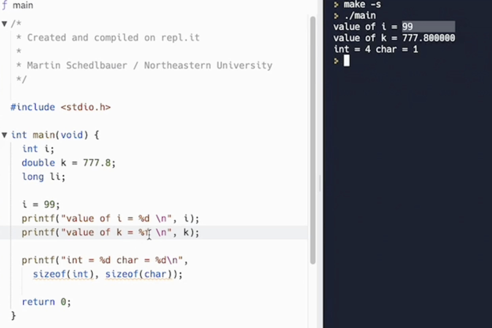

# Hello World C Program Example

Use an editor such as `vim` to type in the program below and save it under the name `hello.c`.

```c
#include <stdio.h>
// 包含标准输入输出库头文件 standard input output
// .h 代表的是 "header"，即头文件（header file）的缩写。

int main(int argc, char* argv[]) {
//  整数argument count 2. 字符串指针数组 argument vector，即参数向量。
// char* 表示一个指向字符（char）的指针。
// argv[]：存储这些命令行参数的字符串数组
// argv[0] 是程序的名称（例如 ./myprogram）。
// argv[1] 到 argv[argc-1] 是传递给程序的实际参数（例如 arg1、arg2、arg3）。
  printf("Hello World\n");
  return 0;
}
```
In Linux, compile the program from the shell using the command:
```py
gcc hello.c -o hello # -o hello是给名字
```
The option `-o hello` specifies the `name` of the executable program. If it is not specified, it will `default` to `a.out`.
这条命令会使用 gcc 编译器将 hello.c 编译成一个名为 hello 的可执行文件。生成的 hello 文件可以在命令行中通过 ./hello 来执行。
```c
./hello
```
解释：
`gcc`：GNU C 编译器，用于编译C程序。
`hello.c`：C程序的源文件。
`-o hello`：指定编译后的输出文件名为 hello。如果没有指定这个选项，默认的输出文件名会是 a.out。
`./hello`：运行当前目录中的 hello 可执行文件。由于当前目录 . 通常不在系统的执行路径中，必须使用 ./ 明确指定运行当前目录下的可执行文件。

The `./` is required because the current directory is generally not included in the system's searched path for programs in Linux.

Line 3: The definition of the main function where execution starts. The body of the function is between { and }.

If there is no return statement, `then the return is implicit` but the return value is not defined and should only be used for functions with a return type of void.

Note that every statement must be terminated by a semi-colon ;.Statements may span several lines.

Source files are text files with the .c extension.

## 系统调用理解
每个C程序都必须有一个调用main的函数。程序的执行从main中的第一条语句开始。main函数在程序运行的进程创建时由操作系统调用。由于程序通常从命令行(shell或终端)运行，它们可以将参数作为输入，这就是为什么main有两个参数的原因:命令行传递的参数数量和与参数对应的字符串数组。


## data types

C 给我们提供了下列定义整数的类型：
- char
- int
- short
- long

int 占据至少两个字节。short 占据至少两个字节。long 占据至少四个字节。

在 Arduino Uno 开发板上，int 占两个字节，范围从 -32,768 到 32,767。在 Arduino MKR 1010 上，int 占四个字节，范围从 -2,147,483,648 到 2,147,483,647。差异还真不小。
在所有的 Arduino 开发板上，short 都占两个字节，范围从 -32,768 到 32,767。long 占四个字节，范围从 -2,147,483,648 到 2,147,483,647。

## 无符号整数
对于以上所有的数据类型，我们都可以在其前面追加一个 unsigned。这样一来，值的范围就不再从负数开始，而是从 0 开始。这在很多情况下是很有用的。
- unsigned char 的范围从 0 开始，至少到 255
- unsigned int 的范围从 0 开始，至少到 65,535
- unsigned short 的范围从 0 开始，至少到 65,535
- unsigned long 的范围从 0 开始，至少到 4,294,967,295

## 溢出的问题
C语言不执行类型检查，因此程序员有责任确保为变量分配了足够的内存来保存分配给变量的值。例如，将32位(4字节)整数赋值给char类型的变量(8位或1字节字符)会导致溢出。赋值仍然完成，四个字节被复制到为一个字节保留的内存中，导致剩余的3个字节溢出到内存中的下三个字节，可能会覆盖其他变量。这是程序员头疼的一个常见问题。现代编译器会“检测”


鉴于所有这些限制，可能会出现一个问题：我们如何确保数字不超过限制？如果超过了限制会怎样？
如果你有一个值为 255 的 unsigned int，自增返回的值为 256，这在意料之中。如果你有一个值为 255 的 unsigned char，你得到的结果就是 0。它重置为了初始值。
如果你有一个值为 255 的 unsigned char，给它加上 10 会得到数字 9：
```c
#include<stdio.h>
int main(void){
    unsigned char j = 255;
    j = j + 10;
    printf("%u", j);  // 9
}
```

If you don't have a signed value, the behavior is undefined. 原文这里可能是 typo，从代码来看，这里描述的是有符号整数的溢出行为。如果你的值是有符号的，程序的行为则是未知的。程序基本上会给你一个很大的值，这个值可能变化，就像这样：

```c
#include <stdio.h>
int main(void){
    char j = 127;
    j = j + 10;
    printf("%u", j);  // 4294967177
}
```

换句话说，C 并不会在你超出类型的限制时保护你。对于这种情况，你需要自己当心。


## 浮点数
浮点类型可以表示的数值范围比整数大得多，还可以表示整数无法表示的分数。

使用浮点数时，我们将数表示成小数乘以 10 的幂。

你可能见过浮点数被写成

1.29e-3
-2.3e+5
和其它的一些看起来很奇怪的形式。

下面的几种类型：

- float
- double
- long double
是用来表示带有小数点的数字（浮点类型）的。这几种类型都可以表示正数和负数。

任何 C 的实现都必须满足的最小要求是 float 可以表示范围在 10^-37 到 10^+37 之间的数，这通常用 32 位比特实现。 double 可以表示一组更大范围的数，long double 可以保存的数还要更多。

与整数一样，浮点数的确切值取决于具体实现。

在现代的 Mac 上，float 用 32 位表示，精度为 24 个有效位，剩余 8 位被用来编码指数部分。

double 用 64 位表示，精度为 53 个有效位，剩余 11 为用于编码指数部分。

long double 类型用 80 位表示，精度为 64 位有效位，剩余 15 位被用来编码指数部分。

你如何能在自己的计算机上确定这些类型的大小呢？你可以写一个程序来干这事儿：
```c
#include <stdio.h>

int main(void) {
  printf("char size: %lu bytes\n", sizeof(char));
  printf("int size: %lu bytes\n", sizeof(int));
  printf("short size: %lu bytes\n", sizeof(short));
  printf("long size: %lu bytes\n", sizeof(long));
  printf("float size: %lu bytes\n", sizeof(float));
  printf("double size: %lu bytes\n", sizeof(double));
  printf("long double size: %lu bytes\n", sizeof(long double));
}
```
在我的系统上（一台现代 Mac），输出如下：
```
char size: 1 bytes
int size: 4 bytes
short size: 2 bytes
long size: 8 bytes
float size: 4 bytes
double size: 8 bytes
long double size: 16 bytes
```

常量
咱们现在来谈谈常量。

常量的声明与变量类似，不同之处在于常量声明的前面带有 const 关键字，并且你总是需要给常量指定一个值。

就像这样：
```c
const int age = 37;
```
这在 C 中是完全有效的，尽管通常情况下将常量声明为大写，就像这样：
```c
const int AGE = 37;
```
虽然这只是一个惯例，但是在你阅读或编写 C 程序时，他能给你提供巨大的帮助，因为它提高了可读性。大写的名字意味着常量，小写的名字意味着变量。

常量的命名规则与变量相同：可以包含任意大小写字母、数字和下划线，但是不能以数字开头。AGE 和 Age10 都是有效的变量名，而 1AGE 就不是了。

另一种定义常量的方式是使用这种语法：
```c
#define AGE 37
```
### Identifiers
An identifier is the name given to entities such as variables, functions, structures, etc. Identifiers must be unique within a program block (its scope). Identifier are used to refer to a memory object.
`
int amount;
double accountBalance;`




```c
#include <stdio.h>

int main(int argc, char* argv[])
{
  for (int i = 0; i < argc; ++i) {
    printf("%i | %s\n", i, argv[i]);//程序会按顺序输出 i 和 argv[i]
  }

  return 0;
}
```

```
0 | ./program
1 | arg1
2 | arg2
```
1.` %i`
含义：用于格式化并输出一个整数（int 类型）。
在这里的作用：输出当前的循环索引 i，即命令行参数的序号。
虽然 %i 和 %d 都可以用于表示整数，在 printf 中它们是等价的。
2. `|`
含义：这是一个竖线字符，没有特别的格式化作用，只是作为一个分隔符出现在输出中，起到视觉分隔的作用。
在这里的作用：用于分隔输出的序号和命令行参数。
3.` %s`
含义：用于格式化并输出一个字符串（char* 类型）。
在这里的作用：输出 argv[i]，即命令行中传递给程序的参数字符串。
4. `\n`
含义：这是一个换行符，表示输出结束后换行。
在这里的作用：每次输出参数信息后，换到下一行进行新的输出，保持输出格式的整齐
```c
#include <stdio.h>

int main() {
  printf("Goodbye, World!");
  return 0;
}
```
f we want to say that our code was run successfully, we will return the number 0. A number greater than 0 will mean that the program that we wrote failed.


## Variables and Types
### Data types
- Integers - whole numbers which can be either positive or negative. Defined using char, int, short, long or long long.
- Unsigned integers - whole numbers which can only be positive. Defined using unsigned char, unsigned int, unsigned short, unsigned long or unsigned long long.
- Floating point numbers - real numbers (numbers with fractions). Defined using float and double.
- Structures - will be explained later, in the Structures section.