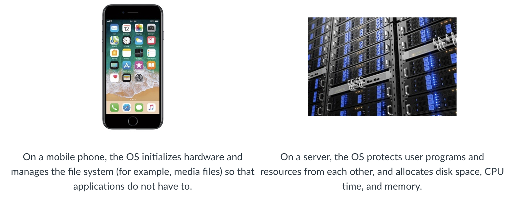

## What is an Operating System?

There are several classic definitions of an OS that you may have seen in an undergraduate course: an OS either manages system resources and their use by programs, or provides the environment and facilities for applications to run on.

## Basic commands line
### basic file management

Sure! Here’s a basic overview of common command line commands formatted in Markdown code blocks:

- `cd ~` is goinh to home directory
- 'pwd' current working directory
- `ls` (Linux/Mac) or `dir` (Windows): Lists the files and directories in the current directory.
- `cd <directory>`: Changes the current directory to `<directory>`.
- `mkdir <directory>`: Creates a new directory named `<directory>`.
- `rmdir <directory>`: Removes an empty directory named `<directory>`.
- `rm <file>`: Deletes a file.
- `rm -r <file>`: recursively deletes
- 
- `cp <source> <destination>`: Copies `<source>` file to `<destination>`.
- `cp <source> <name>`
- cp the whole directory- `cp -r class-projects backup-of-project`
  
- `mv <source> <destination>`: Moves `<source>` file to `<destination>`.
- `ls -a` show all files include .. hidden files.
- `ls -l` present things as lists
- `ls -a -l` show all as lists
- `cd Documents/`
- `cd ..` going back

ex. cd /home/cbw

#### Viewing and Editing Files
- `cat <file>`: Displays the contents of `<file>`.
- `less <file>`: Views the contents of `<file>` in an interactive screen.
- `nano <file>`: Opens `<file>` in the nano editor for editing.
- `vim <file>`: Opens `<file>` in the Vim editor for editing.
- `touch my-notes.txt` make an empty file,just like nano
- 

#### Process Management

- `ps`: Lists running processes.
- `top`: Displays an ongoing view of process activity.
- `kill <pid>`: Terminates the process with process ID `<pid>`.
- `killall <processname>`: Kills all processes with the name `<processname>`.

#### Network Operations
- `ping <hostname>`: Checks the network connection to `<hostname>`.
- `curl <url>`: Fetches the content at `<url>`.
- `wget <url>`: Downloads the file from `<url>`.
- `ssh <username>@<host>`:Secure Shell Connect to `<host>` as `<username>`. connect to another machine
- `ssh <host>`: secure connect 
- `scp my-nites.txt <destination>`copy files to local