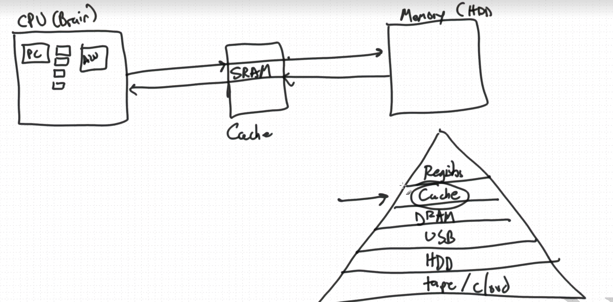
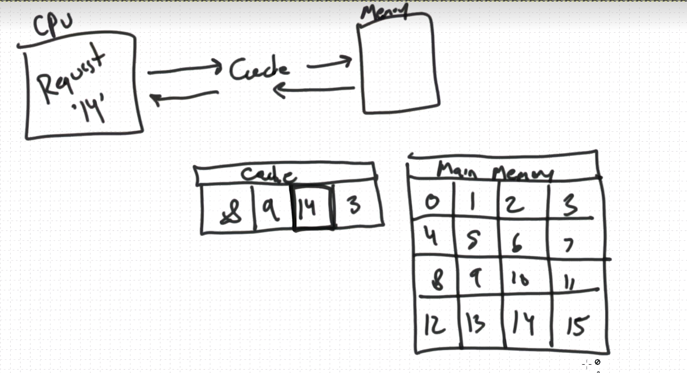
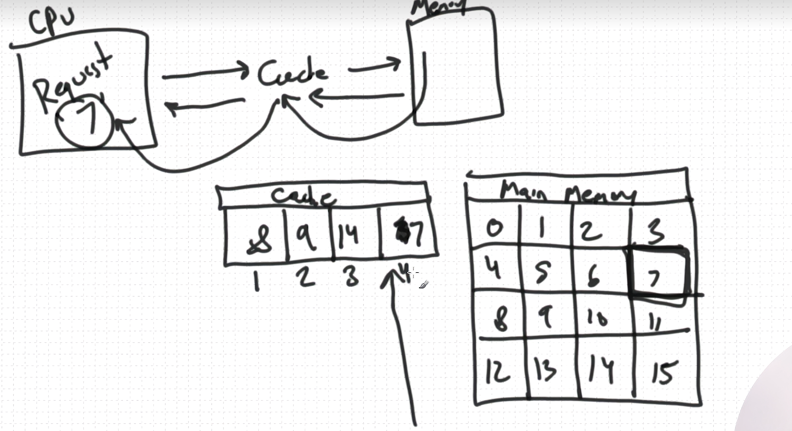
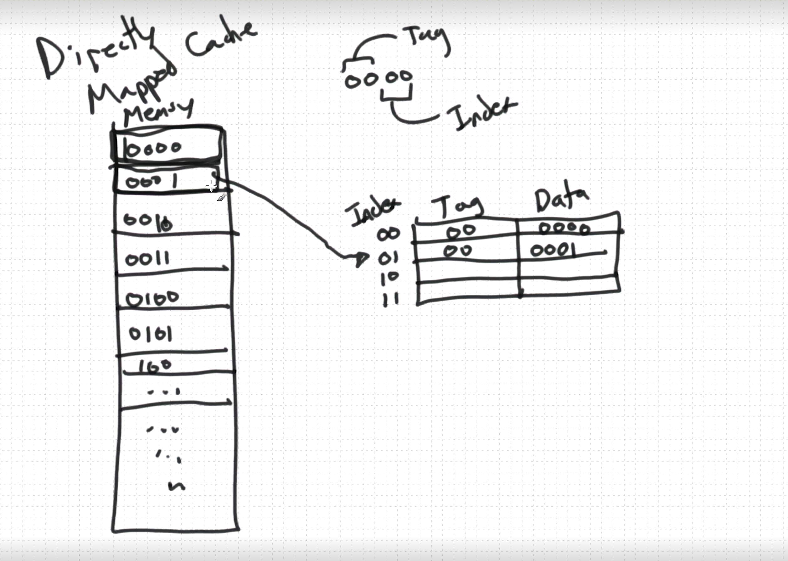

**caching**  
a cache is a small bit of memory located close to the cpu (and sometimes inside the cpu) that allows us to retrieve frequently-accessed data more quickly. in this lesson by dr. mike shah of khoury/boston, we take a look at how exactly a cache works. caching not only occurs within the cpu, but also in file systems, networks, web browsers, databases, and other situations where data is fetched from a slower storage device. the main reason for employing caching is to increase speed.

caching is a technique used in computing to improve the efficiency and speed of data retrieval and processing by storing frequently used data or computations in a temporary, faster-access memory or storage location. the purpose of caching is to reduce the latency and workload on primary data sources, such as slower storage devices or remote servers, by providing quick access to frequently accessed information. here's how caching works and its key concepts:

1. **caching mechanism**: caching involves creating a cache, which is a smaller, faster storage space compared to the primary data source. this cache can be located in various places, such as in the cpu (l1, l2, and l3 caches), main memory (ram), or on dedicated hardware, like solid-state drives (ssds) or caching servers.

2. **cache content**: the cache stores copies of data, instructions, or results from computations that have been recently accessed or are expected to be accessed again in the near future. these cached items are typically organized in a way that allows for rapid retrieval.

3. **cache replacement policy**: caches have limited space, so when new data needs to be cached and there's no room, a cache replacement policy is used to decide which items to remove or replace with the new data. common replacement policies include least recently used (lru), first-in-first-out (fifo), and random replacement.

4. **cache coherency**: ensuring that the data in the cache remains consistent with the data in the primary data source is crucial. cache coherency mechanisms, such as write-through and write-back, help maintain consistency by managing updates to cached data.

5. **types of caches**:  
   - **data caching**: storing copies of frequently used data items, like files, database records, or web pages, to reduce the time it takes to retrieve them from slower storage devices, such as hard drives or network servers.  
   - **instruction caching**: storing frequently used program instructions or machine code to speed up program execution, especially in microprocessors and cpus.  
   - **web caching**: caching web content (html, images, videos, etc.) at proxy servers or content delivery networks (cdns) to reduce latency and bandwidth usage for users accessing web resources.  
   - **browser caching**: storing web page assets in a user's web browser to accelerate subsequent visits to the same website.

6. **cache benefits**:  
   - **faster access**: cached data can be retrieved much more quickly than fetching it from slower primary storage or over a network.  
   - **reduced load**: caching reduces the load on primary data sources, such as databases or web servers, which can help improve their overall performance and scalability.  
   - **lower latency**: caching minimizes the delay experienced when accessing frequently used data or resources.  
   - **bandwidth savings**: web and content caching can reduce network traffic and bandwidth consumption by serving cached content to multiple users.

caching is a fundamental optimization technique used in various computing systems, from cpus and memory systems to web applications and content delivery networks. it plays a crucial role in enhancing system performance and delivering a smoother user experience by minimizing the time and resources needed to access frequently used data and computations.

## Replacement cache,directly mapped cache

TAG 是前面两个
index 是后面两个

