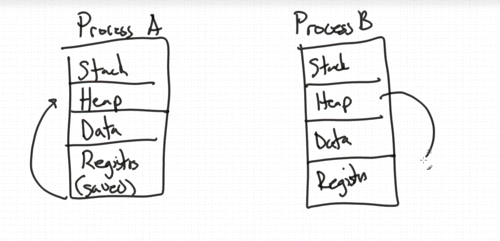
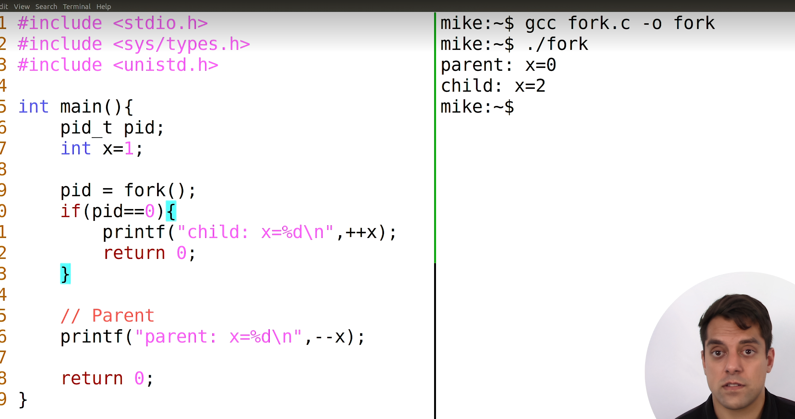
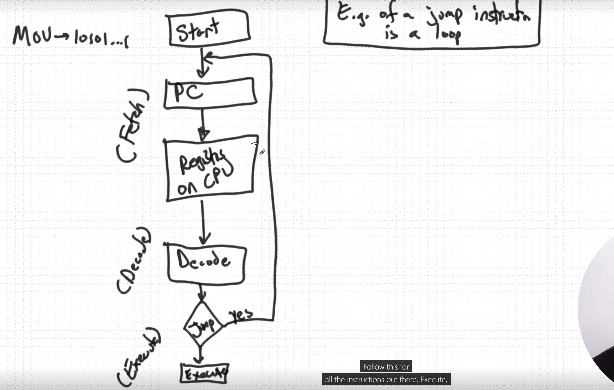

# Key concepts in operating systems  
# 操作系统中的关键概念

in the context of operating systems, a process is a fundamental concept that represents a program in execution.  
在操作系统的上下文中，进程是一个代表正在执行的程序的基本概念。

it is an essential element for managing and executing tasks (generally programs but also the operating system itself, as well as operating system components such as the file system) on a computer system.  
它是管理和执行计算机系统上任务（通常是程序，也包括操作系统本身及其组件，如文件系统）的重要元素。

here are the key aspects and characteristics of a process:  
以下是进程的关键方面和特性：

### 1. program in execution  
### 1. 正在执行的程序  

a process is essentially a program that is loaded into memory and is actively being executed by the computer's central processing unit (CPU). it includes both the program code and the data associated with it.  
进程本质上是被加载到内存中并由计算机的中央处理单元（CPU）积极执行的程序。它包括程序代码及其相关的数据。

### 2. independent and isolated  
### 2. 独立与隔离  

each process operates independently of other processes running on the same system. this isolation ensures that one process cannot directly interfere with or modify the memory or resources of another process. processes are typically encapsulated within their own memory space.  
每个进程独立于同一系统上运行的其他进程。此隔离确保一个进程不能直接干扰或修改另一个进程的内存或资源。进程通常封装在其自己的内存空间中。

### 3. process state  
### 3. 进程状态  

a process can be in one of several states during its execution, including:  
在执行过程中，进程可能处于多种状态之一，包括：

- **running**: the process is currently being executed by the CPU.  
- **运行中**: 进程正在由CPU执行。  

- **ready**: the process is loaded into memory and is ready to run but is waiting for its turn to be scheduled by the operating system.  
- **就绪状态**: 进程已被加载到内存中，准备运行，但正在等待操作系统的调度。  

- **blocked (or waiting)**: the process is temporarily halted because it is waiting for a particular event or resource to become available, such as user input or data from a file.  
- **阻塞状态（或等待中）**: 进程暂时停止，因为它正在等待特定的事件或资源（如用户输入或文件数据）变为可用。  

- **terminated (or completed)**: the process has finished its execution and has been removed from memory.  
- **终止状态（或已完成）**: 进程已完成执行并从内存中移除。  

### 4. process control block (PCB)  
### 4. 进程控制块 (PCB)  

each process is associated with a data structure known as the process control block (PCB).  
每个进程都与一个称为进程控制块（PCB）的数据结构相关联。

the PCB contains important information about the process, such as its program counter (the address of the next instruction to be executed), CPU registers, process state, memory allocation, and other attributes.  
PCB包含有关进程的重要信息，例如程序计数器（下一个要执行的指令的地址）、CPU寄存器、进程状态、内存分配以及其他属性。

the operating system uses the PCB to manage and control processes efficiently.  
操作系统使用PCB来有效管理和控制进程。

### 5. process creation  
### 5. 进程创建  

processes can be created by the operating system itself or by other processes (e.g., a parent process creating child processes).  
进程可以由操作系统本身或其他进程创建（例如，父进程创建子进程）。

process creation involves allocating memory for the process's code and data, initializing the PCB, and setting up various resources.  
进程创建包括为进程的代码和数据分配内存、初始化PCB以及设置各种资源。

### 6. process scheduling  
### 6. 进程调度  

the operating system's scheduler determines which process should be executed next based on scheduling algorithms like round-robin, priority-based scheduling, or others.  
操作系统的调度程序根据轮询、基于优先级的调度等调度算法确定下一个应该执行的进程。

it aims to ensure fair access to the CPU and optimal system performance.  
其目标是确保对CPU的公平访问并优化系统性能。

### 7. inter-process communication (IPC)  
### 7. 进程间通信 (IPC)  

processes often need to communicate and share data with each other.  
进程通常需要相互通信和共享数据。

operating systems provide mechanisms for IPC, such as pipes, sockets, and shared memory, to facilitate communication and data exchange between processes.  
操作系统提供了IPC机制，如管道、套接字和共享内存，以促进进程之间的通信和数据交换。

### 8. process termination  
### 8. 进程终止  

when a process completes its task or is terminated due to an error, it releases the allocated resources, deallocates memory, and informs the operating system of its termination.  
当一个进程完成任务或因错误而终止时，它会释放已分配的资源，释放内存，并通知操作系统其终止。

the OS then updates the PCB and manages the cleanup process.  
操作系统随后更新PCB并管理清理过程。

---

### concurrency and context switching  
### 并发与上下文切换

processes are a fundamental building block of modern multitasking operating systems, allowing multiple programs to run concurrently on a computer while providing isolation and resource management to ensure stable and efficient system operation.  
进程是现代多任务操作系统的基本构建模块，它允许多个程序同时在计算机上运行，同时提供隔离和资源管理，确保系统稳定高效地运行。

only if there are multiple CPUs can an operating system actually run multiple processes concurrently.  
只有在有多个CPU的情况下，操作系统才能真正并行运行多个进程。

on a single CPU, processes are switched rapidly to give the illusion of concurrency.  
在单个CPU上，进程被快速切换，从而给人一种并行运行的错觉。

this mechanism is referred to as **context switching**, and the operating system's "kernel" is responsible for switching between processes.  
这种机制称为**上下文切换**，操作系统的内核负责在进程之间进行切换。

### context switching  
### 上下文切换  

context switching is a crucial operation in the execution and scheduling of processes by an operating system.  
上下文切换是操作系统在进程执行和调度中的关键操作。

it refers to the process of saving the state of a currently running process and restoring the state of another process so that the CPU can seamlessly switch its execution from one process to another.  
它是指保存当前运行进程的状态并恢复另一个进程的状态，使CPU能够无缝地从一个进程切换到另一个进程的过程。

here's how context switching works in the context of process execution and scheduling:  
以下是上下文切换在进程执行和调度中的工作原理：

1. **process scheduling**: in a multitasking operating system, multiple processes are vying for the CPU's attention simultaneously.  
1. **进程调度**: 在多任务操作系统中，多个进程同时争夺CPU的注意力。  

the operating system's scheduler determines which process should be executed next based on various scheduling algorithms, priorities, and time-sharing policies.  
操作系统的调度程序根据各种调度算法、优先级和时间共享策略确定下一个应该执行的进程。

when it's time to switch from one process to another, a context switch is initiated.  
当需要从一个进程切换到另一个进程时，就会启动上下文切换。

2. **saving the current process state**: before the operating system can switch from the currently executing process to another, it must save the state of the current process.  
2. **保存当前进程状态**: 在操作系统从当前正在执行的进程切换到另一个进程之前，它必须保存当前进程的状态。

this includes capturing critical information about the process's execution, such as the program counter (the memory address of the next instruction to execute), CPU registers, and other relevant CPU and memory information.  
这包括捕获进程执行的关键信息，例如程序计数器（下一个要执行的指令的内存地址）、CPU寄存器以及其他相关的CPU和内存信息。

this information is typically stored in the process's process control block (PCB).  
这些信息通常存储在进程的进程控制块（PCB）中。

3. **loading the new process state**: once the current process's state is saved, the operating system selects the next process to run from the ready queue.  
3. **加载新进程状态**: 一旦当前进程的状态保存完毕，操作系统就从就绪队列中选择下一个要运行的进程。

it then retrieves the saved state (PCB) of this selected process.  
然后它会检索该选定

进程的保存状态（PCB）。

this involves loading the program counter and CPU registers with the values stored in the PCB of the new process.  
这包括将程序计数器和CPU寄存器加载为新进程的PCB中存储的值。

4. **execution of the new process**: with the state of the new process loaded, the CPU is now set to execute the selected process.  
4. **执行新进程**: 随着新进程状态的加载，CPU现在准备执行选定的进程。

the operating system starts executing instructions from the new process's code, and it continues until another context switch is required, such as when a time quantum expires (in the case of round-robin scheduling) or when the process enters a waiting state.  
操作系统开始执行新进程代码中的指令，直到需要另一次上下文切换，例如时间片耗尽（在轮询调度的情况下）或进程进入等待状态。

5. **efficiency and overhead**: context switching introduces some overhead because it involves saving and restoring process states, which consumes CPU cycles and memory resources.  
5. **效率与开销**: 上下文切换引入了一些开销，因为它涉及保存和恢复进程状态，这会消耗CPU周期和内存资源。

minimizing this overhead is important for maintaining system efficiency.  
最小化此开销对于维护系统效率至关重要。

context switching allows the operating system to provide the illusion of concurrent execution of multiple processes on a single CPU core.  
上下文切换使操作系统能够提供在单个CPU核心上并发执行多个进程的假象。

it ensures that each process gets its fair share of CPU time and that processes are isolated from each other, preventing one process from directly interfering with or affecting the execution of another.  
它确保每个进程获得公平的CPU时间，并且进程相互隔离，防止一个进程直接干扰或影响另一个进程的执行。

the efficiency and speed of context switching are critical factors in the overall performance of a multitasking operating system.  
上下文切换的效率和速度是多任务操作系统整体性能的关键因素。

# Key concepts in operating systems  
# 操作系统中的关键概念

in the context of operating systems, a process is a fundamental concept that represents a program in execution.  
在操作系统的上下文中，进程是一个代表正在执行的程序的基本概念。

it is an essential element for managing and executing tasks (generally programs but also the operating system itself, as well as operating system components such as the file system) on a computer system.  
它是管理和执行计算机系统上任务（通常是程序，也包括操作系统本身及其组件，如文件系统）的重要元素。

here are the key aspects and characteristics of a process:  
以下是进程的关键方面和特性：

### 1. program in execution  
### 1. 正在执行的程序  

a process is essentially a program that is loaded into memory and is actively being executed by the computer's central processing unit (CPU). it includes both the program code and the data associated with it.  
进程本质上是被加载到内存中并由计算机的中央处理单元（CPU）积极执行的程序。它包括程序代码及其相关的数据。

### 2. independent and isolated  
### 2. 独立与隔离  

each process operates independently of other processes running on the same system. this isolation ensures that one process cannot directly interfere with or modify the memory or resources of another process. processes are typically encapsulated within their own memory space.  
每个进程独立于同一系统上运行的其他进程。此隔离确保一个进程不能直接干扰或修改另一个进程的内存或资源。进程通常封装在其自己的内存空间中。

### 3. process state  
### 3. 进程状态  

a process can be in one of several states during its execution, including:  
在执行过程中，进程可能处于多种状态之一，包括：

- **running**: the process is currently being executed by the CPU.  
- **运行中**: 进程正在由CPU执行。  

- **ready**: the process is loaded into memory and is ready to run but is waiting for its turn to be scheduled by the operating system.  
- **就绪状态**: 进程已被加载到内存中，准备运行，但正在等待操作系统的调度。  

- **blocked (or waiting)**: the process is temporarily halted because it is waiting for a particular event or resource to become available, such as user input or data from a file.  
- **阻塞状态（或等待中）**: 进程暂时停止，因为它正在等待特定的事件或资源（如用户输入或文件数据）变为可用。  

- **terminated (or completed)**: the process has finished its execution and has been removed from memory.  
- **终止状态（或已完成）**: 进程已完成执行并从内存中移除。  

### 4. process control block (PCB)  
### 4. 进程控制块 (PCB)  

each process is associated with a data structure known as the process control block (PCB).  
每个进程都与一个称为进程控制块（PCB）的数据结构相关联。

the PCB contains important information about the process, such as its program counter (the address of the next instruction to be executed), CPU registers, process state, memory allocation, and other attributes.  
PCB包含有关进程的重要信息，例如程序计数器（下一个要执行的指令的地址）、CPU寄存器、进程状态、内存分配以及其他属性。

the operating system uses the PCB to manage and control processes efficiently.  
操作系统使用PCB来有效管理和控制进程。

### 5. process creation  
### 5. 进程创建  

processes can be created by the operating system itself or by other processes (e.g., a parent process creating child processes).  
进程可以由操作系统本身或其他进程创建（例如，父进程创建子进程）。

process creation involves allocating memory for the process's code and data, initializing the PCB, and setting up various resources.  
进程创建包括为进程的代码和数据分配内存、初始化PCB以及设置各种资源。

### 6. process scheduling  
### 6. 进程调度  

the operating system's scheduler determines which process should be executed next based on scheduling algorithms like round-robin, priority-based scheduling, or others.  
操作系统的调度程序根据轮询、基于优先级的调度等调度算法确定下一个应该执行的进程。

it aims to ensure fair access to the CPU and optimal system performance.  
其目标是确保对CPU的公平访问并优化系统性能。

### 7. inter-process communication (IPC)  
### 7. 进程间通信 (IPC)  

processes often need to communicate and share data with each other.  
进程通常需要相互通信和共享数据。

operating systems provide mechanisms for IPC, such as pipes, sockets, and shared memory, to facilitate communication and data exchange between processes.  
操作系统提供了IPC机制，如管道、套接字和共享内存，以促进进程之间的通信和数据交换。

### 8. process termination  
### 8. 进程终止  

when a process completes its task or is terminated due to an error, it releases the allocated resources, deallocates memory, and informs the operating system of its termination.  
当一个进程完成任务或因错误而终止时，它会释放已分配的资源，释放内存，并通知操作系统其终止。

the OS then updates the PCB and manages the cleanup process.  
操作系统随后更新PCB并管理清理过程。

---

### concurrency and context switching  
### 并发与上下文切换

processes are a fundamental building block of modern multitasking operating systems, allowing multiple programs to run concurrently on a computer while providing isolation and resource management to ensure stable and efficient system operation.  
进程是现代多任务操作系统的基本构建模块，它允许多个程序同时在计算机上运行，同时提供隔离和资源管理，确保系统稳定高效地运行。

only if there are multiple CPUs can an operating system actually run multiple processes concurrently.  
只有在有多个CPU的情况下，操作系统才能真正并行运行多个进程。

on a single CPU, processes are switched rapidly to give the illusion of concurrency.  
在单个CPU上，进程被快速切换，从而给人一种并行运行的错觉。

this mechanism is referred to as **context switching**, and the operating system's "kernel" is responsible for switching between processes.  
这种机制称为**上下文切换**，操作系统的内核负责在进程之间进行切换。

### context switching  
### 上下文切换  

context switching is a crucial operation in the execution and scheduling of processes by an operating system.  
上下文切换是操作系统在进程执行和调度中的关键操作。

it refers to the process of saving the state of a currently running process and restoring the state of another process so that the CPU can seamlessly switch its execution from one process to another.  
它是指保存当前运行进程的状态并恢复另一个进程的状态，使CPU能够无缝地从一个进程切换到另一个进程的过程。

here's how context switching works in the context of process execution and scheduling:  
以下是上下文切换在进程执行和调度中的工作原理：

1. **process scheduling**: in a multitasking operating system, multiple processes are vying for the CPU's attention simultaneously.  
1. **进程调度**: 在多任务操作系统中，多个进程同时争夺CPU的注意力。  

the operating system's scheduler determines which process should be executed next based on various scheduling algorithms, priorities, and time-sharing policies.  
操作系统的调度程序根据各种调度算法、优先级和时间共享策略确定下一个应该执行的进程。

when it's time to switch from one process to another, a context switch is initiated.  
当需要从一个进程切换到另一个进程时，就会启动上下文切换。

2. **saving the current process state**: before the operating system can switch from the currently executing process to another, it must save the state of the current process.  
2. **保存当前进程状态**: 在操作系统从当前正在执行的进程切换到另一个进程之前，它必须保存当前进程的状态。

this includes capturing critical information about the process's execution, such as the program counter (the memory address of the next instruction to execute), CPU registers, and other relevant CPU and memory information.  
这包括捕获进程执行的关键信息，例如程序计数器（下一个要执行的指令的内存地址）、CPU寄存器以及其他相关的CPU和内存信息。

this information is typically stored in the process's process control block (PCB).  
这些信息通常存储在进程的进程控制块（PCB）中。

3. **loading the new process state**: once the current process's state is saved, the operating system selects the next process to run from the ready queue.  
3. **加载新进程状态**: 一旦当前进程的状态保存完毕，操作系统就从就绪队列中选择下一个要运行的进程。

it then retrieves the saved state (PCB) of this selected process.  
然后它会检索该选定

进程的保存状态（PCB）。

this involves loading the program counter and CPU registers with the values stored in the PCB of the new process.  
这包括将程序计数器和CPU寄存器加载为新进程的PCB中存储的值。

4. **execution of the new process**: with the state of the new process loaded, the CPU is now set to execute the selected process.  
4. **执行新进程**: 随着新进程状态的加载，CPU现在准备执行选定的进程。

the operating system starts executing instructions from the new process's code, and it continues until another context switch is required, such as when a time quantum expires (in the case of round-robin scheduling) or when the process enters a waiting state.  
操作系统开始执行新进程代码中的指令，直到需要另一次上下文切换，例如时间片耗尽（在轮询调度的情况下）或进程进入等待状态。

5. **efficiency and overhead**: context switching introduces some overhead because it involves saving and restoring process states, which consumes CPU cycles and memory resources.  
5. **效率与开销**: 上下文切换引入了一些开销，因为它涉及保存和恢复进程状态，这会消耗CPU周期和内存资源。

minimizing this overhead is important for maintaining system efficiency.  
最小化此开销对于维护系统效率至关重要。

context switching allows the operating system to provide the illusion of concurrent execution of multiple processes on a single CPU core.  
上下文切换使操作系统能够提供在单个CPU核心上并发执行多个进程的假象。

it ensures that each process gets its fair share of CPU time and that processes are isolated from each other, preventing one process from directly interfering with or affecting the execution of another.  
它确保每个进程获得公平的CPU时间，并且进程相互隔离，防止一个进程直接干扰或影响另一个进程的执行。

the efficiency and speed of context switching are critical factors in the overall performance of a multitasking operating system.  
上下文切换的效率和速度是多任务操作系统整体性能的关键因素。


### fork in operating systems  
### 操作系统中的 fork

**fork** is a system call in Unix-like operating systems used to create a new process.  
**fork** 是类Unix操作系统中的系统调用，用于创建一个新进程。

the new process created by `fork` is called the **child process**, and the original process is called the **parent process**.  
通过 `fork` 创建的新进程称为**子进程**，而原始进程称为**父进程**。

the child process is a copy of the parent process, except for certain differences, such as unique process IDs.  
子进程是父进程的副本，除了某些差异，如不同的进程ID。

here's how `fork` works in more detail:  
以下是 `fork` 工作的详细说明：

1. **process duplication**: when `fork` is called, the operating system makes a copy of the parent process's memory space and creates a new process.  
1. **进程复制**: 当调用 `fork` 时，操作系统会复制父进程的内存空间并创建一个新进程。

this new process is almost identical to the parent, but it has its own process ID and memory.  
新进程几乎与父进程相同，但它有自己的进程ID和内存。

2. **return values**: after a successful `fork`, two processes exist: the parent and the child.  
2. **返回值**: 在成功调用 `fork` 之后，系统中会存在两个进程：父进程和子进程。

`fork` returns different values to the parent and child processes:  
`fork` 会向父进程和子进程返回不同的值：

- the parent process receives the process ID (PID) of the child process.  
- 父进程接收到子进程的进程ID（PID）。  

- the child process receives a return value of `0`.  
- 子进程接收到的返回值为 `0`。

3. **execution differences**: after the fork, both the parent and the child processes continue executing their code.  
3. **执行差异**: 在 `fork` 之后，父进程和子进程继续执行各自的代码。

the operating system schedules them independently.  
操作系统独立调度它们。

they may run in parallel on a multi-core system or in an interleaved manner on a single-core system.  
在多核系统上，它们可能并行运行；在单核系统上，它们可能以交错方式运行。

4. **child process independence**: although the child process is a copy of the parent, it runs independently.  
4. **子进程的独立性**: 尽管子进程是父进程的副本，但它独立运行。

it can execute different code (e.g., by calling `exec` to load a new program), and it has its own resources.  
它可以执行不同的代码（例如，通过调用 `exec` 加载新程序），并拥有自己的资源。

5. **use cases**: `fork` is commonly used in multitasking environments where a parent process needs to create a child process to handle tasks like executing commands or running separate programs.  
5. **使用场景**: `fork` 通常用于多任务环境中，父进程需要创建子进程来处理执行命令或运行独立程序等任务。

it allows processes to work in parallel or to divide workload.  
它允许进程并行工作或分担工作负载。

### C example of `fork`  
### `fork` 的C语言示例

```c
#include <stdio.h>
#include <unistd.h>

int main() {
    // fork a new process
    pid_t pid = fork();

    // error occurred
    if (pid < 0) {
        fprintf(stderr, "Fork Failed\n");
        return 1;
    }
    // child process
    else if (pid == 0) {
        printf("This is the child process (pid: %d)\n", getpid());
    }
    // parent process
    else {
        printf("This is the parent process (pid: %d), child process has pid: %d\n", getpid(), pid);
    }

    return 0;
}
```

**Explanation**  
**解释**

- **`fork()`**: creates a new process. the return value is used to distinguish the parent from the child process.  
- **`fork()`**: 创建一个新进程，返回值用于区分父进程和子进程。

- **`pid < 0`**: if the return value is negative, the `fork` failed.  
- **`pid < 0`**: 如果返回值为负，表示 `fork` 失败。

- **`pid == 0`**: this block is executed by the child process (which gets a return value of `0`).  
- **`pid == 0`**: 该代码块由子进程执行（子进程获得的返回值为 `0`）。

- **`else`**: the parent process executes this block (it receives the child's PID as a return value).  
- **`else`**: 父进程执行此代码块（它接收到子进程的PID作为返回值）。



## fetch-decode-execute cycle

pc: program counter
